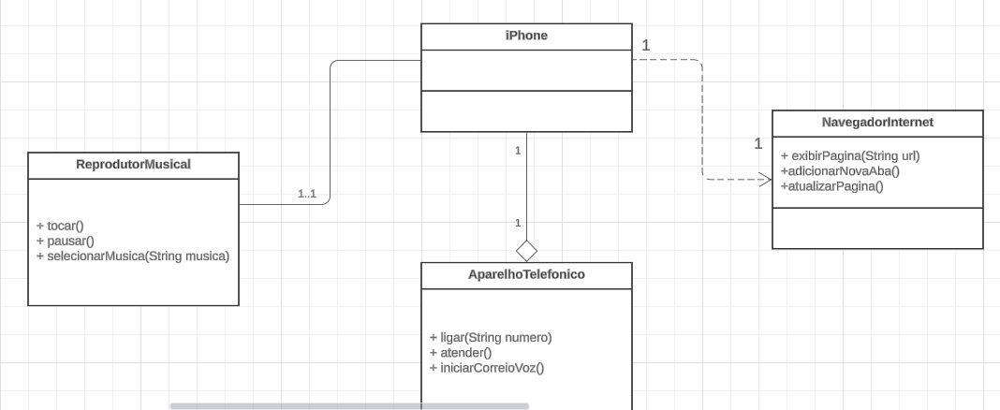

# desafio paradigma de Programação Orientada a Objetos em Java Puro

## Exercício de POO com Java

### Para executar esse projeto você precisa instalar:
  - JRE
  - Java
  - IDE (Eclipse, Intellij, Netbeans ou outro)

